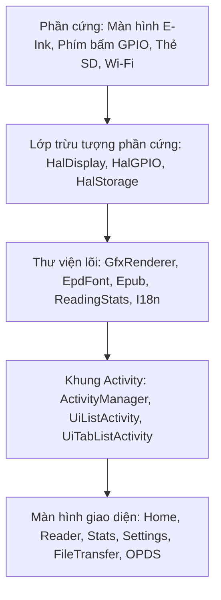

# Kiến trúc: Thiết kế hệ thống và Tương tác giữa các thành phần

## Bối cảnh hệ thống & Phần cứng mục tiêu

CrossPP là firmware máy đọc sách mã nguồn mở được biên dịch qua PlatformIO, nhắm vào dòng vi điều khiển ESP32 (chủ yếu là ESP32-C3 lõi đơn RISC-V @ 160MHz và ESP32-S3 lõi kép Xtensa).

### Giới hạn phần cứng & Tài nguyên chính
- **MCU**: ESP32-C3 (RISC-V lõi đơn @ 160MHz) / ESP32-S3 (Xtensa lõi kép)
- **SRAM**: ~380KB khả dụng trên C3. **Không có PSRAM**. Mọi cấp phát bộ nhớ đều tranh chấp trực tiếp trên DRAM.
- **Màn hình**: E-Ink 800x480 (hoặc 792x528 trên X3), tần số quét chậm đơn sắc, bộ đệm khung hình đơn 48KB (`-DEINK_DISPLAY_SINGLE_BUFFER_MODE=1`).
- **Lưu trữ**: Thẻ MicroSD qua giao tiếp SPI. Bộ nhớ cache, sách, font chữ, từ điển và cài đặt đều nằm trên thẻ SD.
- **Kết nối**: Wi-Fi 2.4GHz (802.11 b/g/n) phục vụ Web UI, WebDAV, Calibre, OPDS và cập nhật OTA.

---

## Kiến trúc thành phần cấp cao



### 1. Lớp trừu tượng phần cứng (HAL) (`lib/hal/`)
- **`HalDisplay`**: Điều khiển chu kỳ làm mới của màn hình E-Ink, waveform, chế độ quét nhanh vs quét toàn bộ, và phép biến đổi xoay màn hình (orientation).
- **`HalGPIO`**: Chuyển đổi tín hiệu nút bấm vật lý và sự kiện chạm cảm ứng thành các sự kiện logic thông qua `MappedInputManager`.
- **`HalStorage` / Singleton `Storage`**: Lớp bọc an toàn luồng (thread-safe) bao quanh SdFat. Bảo vệ bus SPI và máy trạng thái `SdSpiCard` bằng `storageMutex` nhằm tránh lỗi sập hệ thống (panic) do xung đột giữa các task FreeRTOS (vấn đề #518).
- **`HalClock`**: Điều khiển RTC phần cứng DS3231 qua I2C và quản lý đồng bộ thời gian mạng NTP (`syncFromNTP()`) với cơ chế hấp thụ độ trễ khởi động mạng 20 giây qua nhiều máy chủ NTP (Google, Cloudflare, pool.ntp.org).

### 2. Pipeline render đồ họa (`lib/GfxRenderer/`)
- **Kiến trúc đơn bộ đệm (Single-buffer)**: Duy trì duy nhất một vùng nhớ framebuffer 1-bit đen trắng dung lượng 48,000 byte (800×480÷8) trên DRAM.
- **Render thang độ xám (Grayscale)**: Khi cần dither hoặc render nhiều mức xám, một bộ đệm tạm sẽ được cấp phát qua `storeBwBuffer()` và giải phóng ngay sau đó qua `restoreBwBuffer()`.
- **Bộ nhớ đệm font chữ (Font caching)**: `FontCacheManager` quản lý việc giải nén theo nhu cầu các glyph nén lưu trên Flash (`FontDecompressor`) và các bitmap font nạp từ thẻ SD (`SdCardFont`).

### 3. Pipeline phân tích và dàn trang EPUB (`lib/Epub/`)
- **Đọc file nén / Container**: Đọc trực tiếp các file nén EPUB từ thẻ SD thông qua `ZipFile` (sử dụng miniz/uzlib).
- **Phân tích cú pháp XML**: Sử dụng `expat` với kích thước bộ đệm giới hạn (`XML_CONTEXT_BYTES=1024`).
- **Lưu cache section layout**: Kết quả dàn trang (layout) được lưu vào các file nhị phân trong thư mục `/.crosspoint/epub_<hash>/sections/` (`SECTION_FILE_VERSION = 25`). Nhờ đó, thao tác lật trang đọc vị trí ngắt dòng và ranh giới token trực tiếp từ thẻ SD thay vì phải tính toán lại trong RAM.

### 4. Hệ thống thống kê đọc sách (`lib/ReadingStats/`)
- **`ReadingSessionTracker`**: Đo lường thời gian đọc thực tế trong `ReaderActivity`. Tự động áp dụng cửa sổ timeout 5 phút không hoạt động (`ACTIVITY_TIMEOUT_MS`) để loại trừ thời gian tạm dừng.
- **`ReadingStatsStore`**: Lưu trữ dữ liệu tổng hợp hàng ngày vào file `/.crosspoint/reading_stats.json` qua `PersistableStoreBase`. Giữ tối đa 365 ngày lịch sử đọc gần nhất (`MAX_DAYS`).
- **`ReadingStatsInsights`**: Hàm thuần túy (pure function) phân tích thói quen đọc (chuỗi ngày liên tiếp - streak, trung bình 7/30 ngày, ngày đọc nhiều nhất, thứ trong tuần hay đọc nhất) mà không cần thay đổi schema dữ liệu JSON.
- **`ReadingStatsActivity` (`src/activities/stats/`)**: Giao diện thống kê 4 tab (`Tổng quan` dạng danh sách, `Theo sách`, `Heatmap`, và `Cài đặt`) xây dựng trên `UiTabListActivity`, hỗ trợ căn chỉnh đồng hồ trực tiếp và đảm bảo an toàn bộ đệm stack (< 256 B).

### 5. Vòng đời giao diện (Activity Lifecycle) (`src/activities/`)
- Các màn hình UI kế thừa từ `Activity`, `UiListActivity`, hoặc `UiTabListActivity`.
- Được điều phối tập trung bởi `ActivityManager` bằng cách cấp phát động trên heap:
  ```cpp
  currentActivity->onExit();
  delete currentActivity;
  currentActivity = nextActivity;
  currentActivity->onEnter();
  ```
- Mọi bộ đệm heap hoặc task FreeRTOS được tạo trong `onEnter()` **bắt buộc** phải được hủy sạch trong `onExit()` trước khi instance của activity bị giải phóng.
