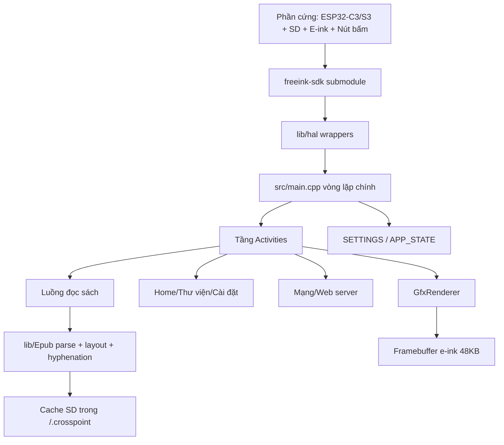

# Kiến trúc hệ thống

CrossPoint là firmware e-reader cho ESP32 (Xteink X3/X4, X4 Pro, Seeed Sticky, M5Stack Paper Mono), build bằng PlatformIO. Kiến trúc: vòng lặp ứng dụng điều khiển bằng Activity, settings/state lưu bền trên SD, cache SD-first, pipeline render tối ưu cho e-ink. Tài liệu gốc tiếng Anh chi tiết hơn: `docs/contributing/architecture.md`.

## Sơ đồ tổng quan

## Vòng đời runtime

Entry point: `src/main.cpp`.

1. Boot → init GPIO, serial (tùy env), SD storage.
2. Load `SETTINGS` (`CrossPointSettings`) và `APP_STATE` (`CrossPointState`) từ `/.crosspoint/settings.json` / `state.json`.
3. Init display + load ~80 font objects toàn cục (flash-resident).
4. Có sách đang đọc dở → vào Reader activity; không → Home activity.
5. Vòng lặp: cập nhật input → chạy `loop()` của activity hiện tại → xử lý auto-sleep/power → delay ngắn cân bằng responsiveness/pin.
6. Đủ điều kiện sleep → lưu state + sleep frame buffer (`/.crosspoint/sleep_frame.bin`) → deep sleep.

## Mô hình Activity

Activities là controller mức màn hình, kế thừa `src/activities/Activity.h`; luồng lồng nhau dùng `ActivityWithSubactivity.h`. Điều phối bởi `ActivityManager` (xem `docs/activity-manager.md`).

- `onEnter()` / `onExit()`: cấp phát và giải phóng tài nguyên. **Activity heap-allocated và bị `delete` khi thoát** — mọi buffer/task tạo trong `onEnter()` phải giải phóng trong `onExit()` (task FreeRTOS phải `vTaskDelete()` trước khi activity bị hủy).
- `loop()`: xử lý mỗi frame. `skipLoopDelay()` / `preventAutoSleep()` cho luồng dài (web server).

Nhóm activity: `home/` (thư viện), `reader/` (đọc EPUB/XTC/TXT), `settings/`, `network/` (Wi-Fi, web server), `boot_sleep/`, `browser/` (file browser), `util/` (dialog, keyboard, BMP viewer).

## Pipeline đọc sách

`ReaderActivity` dispatch theo đuôi file (`ReaderActivity.cpp:31-37`): `.xtc` → `XtcReaderActivity`, `.txt`/`.md` → `TxtReaderActivity`, mặc định → `EpubReaderActivity`.

Đường EPUB:

1. `Epub.load()` định vị container/OPF, dựng hoặc đọc `book.bin` (metadata, spine, TOC), load `css_rules.cache` hoặc parse CSS từ manifest.
2. Mở chương: có `sections/N.bin` khớp tham số render → đọc thẳng; không → parse HTML, layout, hyphenate, ghi cache.
3. Cache-busting theo: font, cỡ chữ, line spacing, margin, orientation, alignment, hyphenation, embedded CSS, focus reading.
4. Trang hiện tại render qua `GfxRenderer` → framebuffer → chính sách refresh e-ink.
5. Tiến độ lưu vào `progress.bin`; XPath KOReader resolve qua bảng offset trong section cache.

Lý do cache SD-first: RAM C3 chỉ ~380KB — dữ liệu parse/layout đắt đỏ được persist xuống SD để mở lại/lật trang không reparse.

## Trạng thái và lưu trữ

- `SETTINGS` (`src/CrossPointSettings.h`): preferences người dùng, `/.crosspoint/settings.json`.
- `APP_STATE` (`src/CrossPointState.h`): trạng thái phiên (sách đang mở, ngữ cảnh sleep), `/.crosspoint/state.json`.
- Các store khác (đều dưới `/.crosspoint/`): `recent.json`, `wifi.json`, `opds.json`, `bookmarks/`, `epub_<hash>/` per sách.
- Mọi ghi SD đi qua `HalStorage` (mutex `storageMutex`) — SdFat không thread-safe, cấm gọi trực tiếp.

## Kiến trúc mạng

`CrossPointWebServerActivity` + `src/network/CrossPointWebServer.cpp`:

- HTTP :80 (file UI, settings API, WebDAV), WebSocket :81 (upload nhanh), UDP discovery.
- Chế độ STA / AP (hotspot, kèm QR) / Calibre Wireless.
- OTA: `OtaUpdater.cpp` check GitHub Releases, tải về partition OTA đối lập (`partitions.csv`: `app0`/`app1` 6.4MB mỗi cái), rồi boot-switch. `FirmwareBoardTag.h` quét tag `CROSSPOINT-BOARD-V1:<board>;` trong image để từ chối flash nhầm board (các board S3 dùng chung chip_id nên check của esp_image_header không phân biệt được).

## Tài sản sinh lúc build

Không sửa tay: `src/network/html/*.generated.h` (từ `data/html/`, qua `scripts/build_html.py`), `lib/I18n/I18n{Keys,Strings}.*` (từ `lib/I18n/translations/*.yaml`, qua `scripts/gen_i18n.py`), hyphenation headers (`scripts/generate_hyphenation_trie.py`).

## Ràng buộc định hình thiết kế

- ~380KB RAM (C3, không PSRAM) → cache SD-first, allocation kiểm soát chặt, single framebuffer 48KB (`EINK_DISPLAY_SINGLE_BUFFER_MODE=1`).
- E-ink refresh chậm (1–2s full update) → gom batch render/update.
- Single-core → vòng lặp chính phải responsive (input, power, watchdog).
- Code chạy từ flash qua I-cache → ISR phải `IRAM_ATTR`, dữ liệu ISR đọc phải `DRAM_ATTR`.
