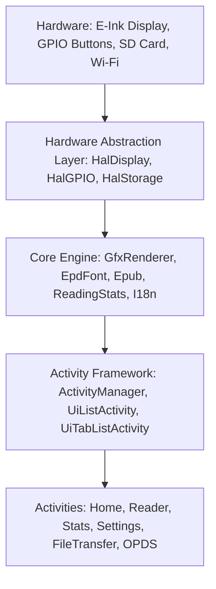

# Architecture: System Design and Component Interaction

## System Context & Target Hardware

CrossPP is custom e-reader firmware compiled via PlatformIO targeting ESP32 family microcontrollers (chiefly ESP32-C3 single-core RISC-V @ 160MHz and ESP32-S3 dual-core Xtensa).

### Primary Hardware & Resource Limits
- **MCU**: ESP32-C3 (RISC-V single-core @ 160MHz) / ESP32-S3 (Xtensa dual-core)
- **SRAM**: ~380KB usable on C3. **No PSRAM**. Every allocation directly competes for DRAM.
- **Display**: 800x480 (or 792x528 on X3) E-Ink display, slow monochrome refresh, single 48KB framebuffer (`-DEINK_DISPLAY_SINGLE_BUFFER_MODE=1`).
- **Storage**: MicroSD card via SPI bus. Caching, books, fonts, dictionaries, and settings all reside on the SD card.
- **Connectivity**: 2.4GHz Wi-Fi (802.11 b/g/n) for Web UI, WebDAV, Calibre, OPDS, and OTA.

---

## High-Level Component Architecture



### 1. Hardware Abstraction Layer (HAL) (`lib/hal/`)
- **`HalDisplay`**: Controls physical E-Ink update cycles, waveforms, fast vs full refresh, and orientation transforms.
- **`HalGPIO`**: Translates raw hardware buttons and touch events into logical events through `MappedInputManager`.
- **`HalStorage` / `Storage` singleton**: Thread-safe wrapper over SdFat. Protects the SPI bus and `SdSpiCard` state machine via `storageMutex` to prevent task collision panics (issue #518).

### 2. Graphic Rendering Pipeline (`lib/GfxRenderer/`)
- **Single-buffer architecture**: Keeps exactly one 48,000-byte (800×480÷8) 1-bit monochrome framebuffer in DRAM.
- **Grayscale rendering**: When dithering or multi-level gray is required, a temporary buffer is allocated via `storeBwBuffer()` and released via `restoreBwBuffer()`.
- **Font caching**: `FontCacheManager` manages on-demand decompression of Flash-resident compressed glyphs (`FontDecompressor`) and SD-card loaded font bitmaps (`SdCardFont`).

### 3. EPUB Parsing & Layout Pipeline (`lib/Epub/`)
- **Zip / Container**: Reads EPUB archives directly from SD card through `ZipFile` (using miniz/uzlib).
- **XML Parsing**: Uses `expat` with restricted buffer sizes (`XML_CONTEXT_BYTES=1024`).
- **Section Caching**: Layout computation is cached into binary section files under `/.crosspoint/epub_<hash>/sections/` (`SECTION_FILE_VERSION = 25`). Page turn lookups read pre-measured line and token boundaries from SD rather than recalculating in RAM.

### 4. Reading Statistics Subsystem (`lib/ReadingStats/`)
- **`ReadingSessionTracker`**: Measures real reading time during `ReaderActivity`. Applies a 5-minute inactivity window (`ACTIVITY_TIMEOUT_MS`).
- **`ReadingStatsStore`**: Persists aggregate daily stats (`/.crosspoint/reading_stats.json`) via `PersistableStoreBase`. Stores up to 365 days of reading history (`MAX_DAYS`).
- **`ReadingStatsInsights`**: Pure-function habit analysis computing current/longest streak, 7/30 day averages, best reading day, and weekday distribution without schema modifications.

### 5. UI Activity Lifecycle (`src/activities/`)
- Activities are stateful UI screens inheriting from `Activity`, `UiListActivity`, or `UiTabListActivity`.
- Managed strictly by `ActivityManager` using heap allocation:
  ```cpp
  currentActivity->onExit();
  delete currentActivity;
  currentActivity = nextActivity;
  currentActivity->onEnter();
  ```
- Any heap buffer or FreeRTOS task spawned in `onEnter()` **must** be destroyed in `onExit()` before the activity is deleted.
